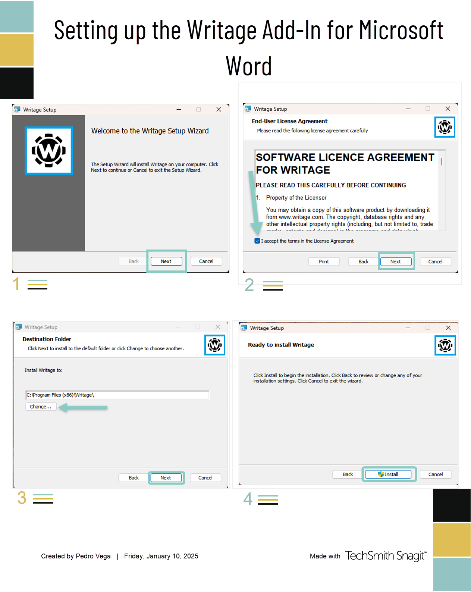
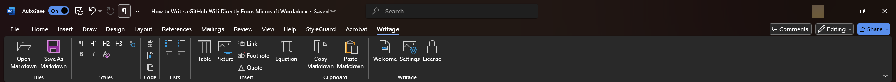
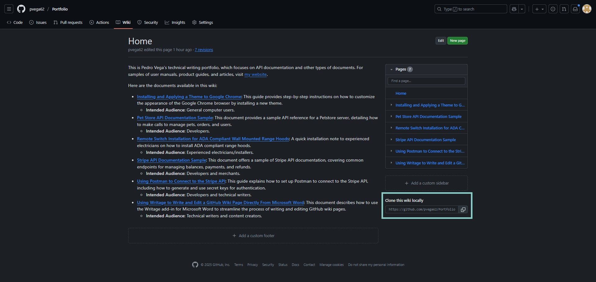
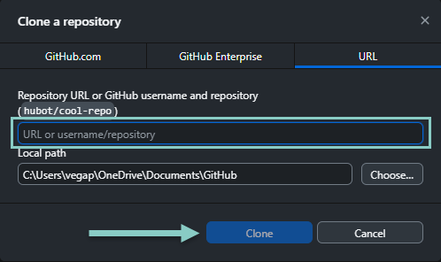
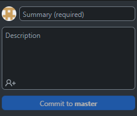

## Introduction
This is a guide on how to use the Writage add-in for Microsoft Word to write and edit GitHub wiki pages directly from Word.

This could be beneficial for writers who prefer Word's familiar interface and features, while still being able to leverage GitHub's version control and collaboration capabilities.

Writage is a Markdown editor add-in for Microsoft Word. It allows users to write and edit Markdown documents directly within Word, making it easier to create and format content for GitHub wikis.

A Markdown document pushed to the wiki repository will appear as a new page on the wiki.

## Prerequisites

-   [The Writage add-in for Microsoft Word](https://www.writage.com/).
    -   **NOTE**: Writage comes with a 14-day free trial. Afterward, you will have to buy a license.
-   [The latest version of Microsoft Word](https://www.microsoft.com/en-us/microsoft-365/download-office).
-   [The latest version of GitHub Desktop](https://desktop.github.com/download/).
-   An existing GitHub Repository with a wiki.

## Instructions

### Setting up Writage

1.  Follow the installation prompts to set up the Writage add-in.

### Writage in Microsoft Word

Once you install the Writage add-in, you can write and edit a Markdown document like a regular Word document. With Writage, you can open existing Markdown files directly in Word, and save Word documents as Markdown files.

### Converting a Markdown document into a PDF file

1.  Open the Markdown document in Word.
2.  Click **File \> Save as.**
3.  Select **PDF** in the file type drop-down menu.
4.  Save the file in a chosen location.

### Cloning a GitHub Wiki to GitHub Desktop

GitHub Desktop doesn't automatically clone a GitHub Wiki. You will have to clone it manually.

1.  Open the wiki and copy the URL in the page’s lower right corner.

    

2.  In GitHub Desktop, press **CTRL+SHIFT+O** to open the "Clone a Repository" dialog.
3.  Click on the **URL** tab.
4.  Paste the wiki’s URL and press **Clone.**

    

### Pushing a Markdown document to a GitHub Wiki

Once you've written a Markdown document in Word, you can push it to the GitHub Repository wiki without needing to copy and paste it to the GitHub Markdown editor and format it there.

1.  Save the Markdown document to the wiki folder set up when installing GitHub Desktop.
2.  Open the GitHub Desktop app.
3.  Select the wiki repository.
4.  Commit the changes (add a summary).
5.  Press **CTRL+P** to push the changes to the wiki.

**NOTE:** Add a summary to the file before it can be pushed to the wiki. The summary briefly describes the changes made to the document, which helps other contributors understand the updates without reading the entire document.

6.  Open the wiki in a browser to double-check the updated wiki.

Repeat the steps to push the document to GitHub when creating a new document or editing an existing document.

