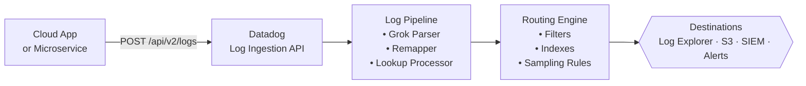

import Tabs from '@theme/Tabs'
import TabItem from '@theme/TabItem'

Use the Datadog **Log Ingestion application programming interface (API)** to send JSON log events directly into Datadog Log Management. You can ingest logs from cloud apps, microservices, or any system emitting telemetry. Once you ingest logs, they're available in **Log Explorer** within seconds. You can process, route, and archive them using **Log Pipelines**.

This endpoint supports high-throughput, real-time ingestion of structured and
semi-structured JSON payloads.

## Actions supported by this API

- Ship logs directly from cloud apps without installing the Datadog Agent.
- Apply pipeline processors, such as Grok Parser, Remapper, and Lookup Processor, to incoming data.
- Route logs to indexes, archives, or alert destinations based on content.
- Reduce indexing cost by combining this endpoint with sampling and filtering rules.

:::note
For more information about managing credentials, see [Datadog API and application keys](https://docs.datadoghq.com/account_management/api-app-keys/).
:::

## Before you start

Make sure you have:

- A **Datadog API key** with log ingestion permissions. Find this in **Organization Settings** → **API Keys**.
- Your **Datadog site address**. This address varies by region:

  | Region | Site address |
  |---|---|
  | US (east) | `datadoghq.com` |
  | US3 (west) | `us3.datadoghq.com` |
  | US5 (central) | `us5.datadoghq.com` |
  | EU (Europe) | `datadoghq.eu` |
  | AP1 (Japan) | `ap1.datadoghq.com` |
  | AP2 (Australia) | `ap2.datadoghq.com` |

- `curl` or Postman installed.
- JSON-formatted log payloads.

## Pipeline overview

<Tabs>
<TabItem value="image" label="Mermaid (image)" default>


</TabItem>
<TabItem value="diagram" label="Mermaid (code)">



</TabItem>
<TabItem value="ascii" label="ASCII">

```text title="ASCII diagram"
 [Cloud App]      POST /api/v2/logs     [Datadog Log]
 [or Microservice] -------------------> [Ingestion API]
                                               |
                                               v
                                        [Log Pipeline]
                                       (Grok, Remap,
                                           Lookup)
                                               |
                                               v
                                        [Routing Engine]
                                       (Filters, Indexes,
                                             Rules)
                                               |
                                               v
                                        { Destinations }
                                       (Explorer, S3,
                                        SIEM, Alerts)
```

</TabItem>
</Tabs>

## Ingest endpoint

<span className="badge badge--info">POST</span> `https://http-intake.logs.{dd_site}/api/v2/logs`

Replace `{dd_site}` with your region's site address, for example, `datadoghq.com` or `ap2.datadoghq.com`.

### Request headers

| Header | Value | Required | Description |
|---|---|---|---|
| `DD-API-KEY` | `<your_api_key>` | Yes | Your Datadog API key |
| `Content-Type` | `application/json` | Yes | Payload format |
| `Content-Encoding` | `gzip` | Optional | Compressed payload format (recommended for high-volume batches) |

### Request body

The request body is a JSON array of one or more log objects. Each log object supports the following fields:

| Field | Type | Required | Description |
|---|---|---|---|
| `message` | string | Yes | The log message body |
| `ddsource` | string | Recommended | The technology the log originates from, for example, `python` or `nginx`. |
| `ddtags` | string | Optional | Comma-separated tags, for example, `env:prod,team:payments`. |
| `hostname` | string | Optional | The name of the host that generated the log |
| `service` | string | Recommended | The name of the app or service |
:::note
You must include the `message` field. All other fields are optional but Datadog recommends them. Datadog uses `service`, `ddsource`, and `ddtags` for filtering, faceting, and pipeline matching.
:::
#### Example payload

```json title="Payload: single log"
[
  {
    "message": "Transaction failed: Gateway timeout",
    "ddsource": "payment-gateway",
    "ddtags": "env:prod,region:us-east-1",
    "hostname": "payments-host-01",
    "service": "payment-gateway",
    "timestamp": "2025-11-15T08:30:00Z",
    "transaction_id": "txn_998877",
    "customer_id": "cus_554433",
    "level": "ERROR"
  }
]
```
:::note
The `timestamp` must use International Organization for Standardization (ISO) 8601 Coordinated Universal Time (UTC) format. Datadog uses this format for timeline alignment in Log Explorer. Datadog indexes logs submitted without a timestamp using the ingest time.
:::

### cURL example

```bash title="cURL"
export DD_API_KEY="your_datadog_api_key_here"
export DD_SITE="datadoghq.com"

curl -X POST "https://http-intake.logs.$DD_SITE/api/v2/logs" \
  -H "DD-API-KEY: $DD_API_KEY" \
  -H "Content-Type: application/json" \
  -d '[
    {
      "message": "Transaction failed: Gateway timeout",
      "ddsource": "payment-gateway",
      "ddtags": "env:prod,region:us-east-1",
      "hostname": "payments-host-01",
      "service": "payment-gateway",
      "level": "ERROR",
      "transaction_id": "txn_998877"
    }
  ]'
```

## Response codes

| Code | Status | Description |
|---|---|---|
| `202` | Accepted | Payload accepted and queued for indexing |
| `400` | Bad request | Formatting or validation error |
| `401` / `403` | Unauthorized / Forbidden | Missing API key (`401`) or invalid key / insufficient permissions (`403`) |
| `413` | Payload too large | Payload exceeds 5 MB uncompressed (50 MB gzip) |
| `429` | Too many requests | Ingestion rate limit exceeded |

#### 202 accepted

A `202 Accepted` response confirms Datadog received the payload. This response has an empty body. The log events appear in Log Explorer within a few seconds.

```http title="Response: 202 Accepted"
HTTP/1.1 202 Accepted
```

#### 400 bad request

Datadog returns this code when a payload has formatting or validation errors:

- Incorrect JSON syntax or unescaped characters.
- The required `message` field is missing.
- The uncompressed payload exceeds the 5 MB limit.

```json title="Response: 400 Bad Request"
{
  "errors": ["Invalid JSON"]
}
```

#### 401 unauthorized and 403 forbidden

Datadog returns `401 Unauthorized` if the `DD-API-KEY` header is missing. Datadog returns `403 Forbidden` if the API key is invalid or lacks log ingestion permissions:

```json title="Response: 403 Forbidden"
{
  "errors": ["Forbidden"]
}
```

#### 413 payload too large

Datadog returns this code when the request payload exceeds the maximum size limit: 5 MB for uncompressed JSON or 50 MB for gzip-compressed data.

```json title="Response: 413 Payload Too Large"
{
  "errors": ["Payload too large"]
}
```

#### 429 too many requests

The client exceeded the request rate limit. Reduce request frequency or batch log objects into an array payload.

## Batching multiple log events

You can send up to **1,000 log entries** in a single request by passing an array.
Datadog recommends this approach for high-throughput services.

```json title="Payload: batched logs"
[
  {
    "message": "User login succeeded",
    "service": "auth-service",
    "ddsource": "python",
    "ddtags": "env:prod",
    "level": "INFO"
  },
  {
    "message": "Transaction failed: Gateway timeout",
    "service": "payment-gateway",
    "ddsource": "python",
    "ddtags": "env:prod",
    "level": "ERROR",
    "transaction_id": "txn_998877"
  }
]
```

**Limits:**
- Max payload size: **5 MB** per uncompressed request (**50 MB** when compressed with `gzip`)
- Max individual log size: **1 MB**
- Max array entries: **1,000 log objects**

## Common use cases

- Ingesting logs from microservices without deploying the Datadog Agent.
- Sending structured JSON events from serverless functions such as Amazon Web Services (AWS) Lambda or Google Cloud Run.
- Streaming telemetry from IoT devices or edge services.
- Routing enriched events to security information and event management (SIEM), S3, or alerting destinations via Log Pipelines.
- Submitting logs from continuous integration and continuous delivery (CI/CD) pipelines or deployment scripts.

## Troubleshooting

| Issue | Probable cause | Solution |
|---|---|---|
| `401 Unauthorized` | Incorrect or missing API key | Verify `DD_API_KEY` in **Org Settings** → **API Keys** |
| `400 Bad Request` | Malformed JSON | Validate with `jq . payload.json` before sending |
| Log not in Explorer | Pipeline filter excluding log | Clear filters; check index routing rules |
| Timestamp out of order | Non-UTC or non-ISO 8601 format | Use `"2025-11-15T08:30:00Z"` format |
| `429 Too Many Requests` | Rate limit exceeded | Batch log objects into a single array payload |

## Next steps

- [Route cloud app logs into a pipeline](./sop-route-cloud-apps.md)
- [Create a Postman mock server](./using-postman-mock-server.md)
- [Parallel observability overview](./before-you-begin.md)
- [Event streams and observability pipelines](./event-streams.md)
- [Datadog Log Ingestion API Reference](https://docs.datadoghq.com/api/latest/logs/)
- [Log Pipeline Processors](https://docs.datadoghq.com/logs/log_configuration/processors/)
