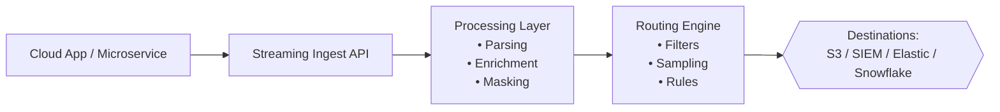

import Tabs from '@theme/Tabs';
import TabItem from '@theme/TabItem';

## Introduction
Use this API to send event data into a pipeline for processing, filtering, enrichment, and routing.

This endpoint supports **high-throughput, real-time ingestion** and supports structured and semi-structured JSON events. It’s ideal for cloud apps, microservices, IoT devices, or any system emitting telemetry.

---

## API functions
- Ship logs and metrics directly into a pipeline  
- Normalize and enrich data before sending it downstream  
- Reduce cost by filtering or sampling early  
- Build flexible pipelines without vendor lock-in  

---

## Before you start
Make sure you have:

- An **API Token** with ingestion permissions  
- A **Stream ID**  
- JSON-formatted event payloads  
- `curl` or Postman installed  

---

## Pipeline overview
<Tabs>
<TabItem value="diagram" label="Mermaid (code)">

</TabItem>
<TabItem value="image" label="Mermaid (image)">


</TabItem>
<TabItem value="ascii diagram" label="ASCII">
```stl
+--------------+       +------------------+       +----------------+       +----------------+
|  Cloud App   | --->  |  Ingest API      | --->  |   Processing   | --->  |   Routing      |
| (Logs/Events)|       | (POST /ingest)   |       | (Parse/Enrich) |       | (Rules Engine) |
+--------------+       +------------------+       +----------------+       +----------------+
                                                                               |
                                                                               v
                                                                    +----------------------+
                                                                    |    Destinations      |
                                                                    |  S3 | SIEM | DW | ES |
                                                                    +----------------------+
```
</TabItem>
</Tabs>

## Ingest endpoint

```
POST /v1/streams/ingest
```
### Request headers
| Header        | Value              | Required | Description     |
| ------------- | ------------------ | -------- | --------------- |
| Authorization | `Bearer <token>`   | Yes      | API token       |
| Content-Type  | `application/json` | Yes      | JSON payload    |
| X-Stream-Id   | `<your-stream-id>` | Yes      | Target pipeline |

### Request body
```json
{
  "timestamp": "2025-02-12T14:32:15Z",
  "source": "payments-app",
  "event": {
    "transactionId": "txn_30921",
    "status": "approved",
    "latency_ms": 182,
    "amount": 499,
    "currency": "USD"
  },
  "metadata": {
    "env": "prod",
    "team": "payments"
  }
}
```
#### Notes
- `timestamp`: ISO 8601 format
- `event`: Main event data (key-value pairs)
- Max payload size: **1 MB**

## Response
### 200 OK
```json
{
  "status": "accepted",
  "ingested_bytes": 527,
  "stream_id": "a0c3b4de-1923-4ff1-8dba-f92ad912d20f"
}
```

### 400 Bad request

Common issues:

- Invalid JSON
- Incorrect timestamp format
- Missing `source` or `event` fields
- Payload exceeds maximum size

```json
{
  "error": "invalid_format",
  "detail": "The 'timestamp' field must be a valid ISO 8601 string."
}
```
### 401 Unauthorized

- Token missing or expired.

### 429 Rate limited

- Reduce request rate or batch events.

## cURL example
```bash
curl -X POST "https://api.example.com/v1/streams/ingest" \
  -H "Authorization: Bearer $TOKEN" \
  -H "Content-Type: application/json" \
  -H "X-Stream-Id: $STREAM_ID" \
  -d @event.json
```
## Common use cases

- Ingesting logs from microservices
- Streaming telemetry from IoT devices
- Normalizing events from distributed systems
- Routing enriched events to SIEM, S3, Elastic, or Snowflake
- Real-time fraud or anomaly detection pipelines

## Troubleshooting
| Symptom                       | Likely Cause               | Fix                        |
| ----------------------------- | -------------------------- | -------------------------- |
| No events showing in pipeline | Wrong Stream ID            | Copy the correct Stream ID |
| Payload rejected              | Invalid JSON               | Validate using `jq`        |
| Missing fields                | Nested structure mismatch  | Review parsing rules       |
| High latency                  | Large payloads or batching | Reduce batch size          |

## Next steps
- Add parsing, masking, or enrichment rules
- Route data to multiple destinations
- Reduce cost with sampling or filtering
- Build pipeline metrics and dashboards
