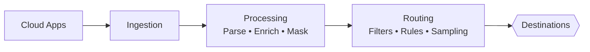

import Tabs from '@theme/Tabs';
import TabItem from '@theme/TabItem';

This page provides the essential context, prerequisites, and tooling you'll need before diving into the Data Pipelines documentation.  
Whether you're new to observability pipelines or just new to this set of docs, start here.

A little preparation goes a long way toward making the API reference, how-to guides, and architecture concepts easier to understand.

---

## What you’ll learn in this section

This documentation section covers:

1. **Foundational Concepts**  
   Understanding event streams, processing layers, routing, and destinations.

2. **Ingestion Mechanics**  
   How to send logs and metrics directly into a pipeline using a high-throughput API.

3. **Hands-On Workflows**  
   How to route cloud app logs, verify ingestion, and deliver data to different destinations.

If you want to explore the docs in the recommended order:

### Start with concepts  
[Event Streams & Observability Pipelines](./concept-observability-pipelines)

### Then learn the ingestion API  
[Ingest Events Using the Streaming Ingest API](./api-ingest-stream.md)

### Then follow the hands-on guide  
[Route Cloud Application Logs Into a Pipeline](./route-cloud-app-logs-guide)

---

## Tools you’ll need

You’ll get the most out of the examples if you have the following installed:

- **cURL** or **Postman**  
  For sending API requests and experimenting with ingestion.
- **A code editor**, preferably **VS Code**  
  For editing sample JSON payloads.
- **A terminal or shell**  
  macOS, Linux, or Windows PowerShell all work.
- **A browser**  
  To view live events, routing rules, and pipeline diagrams once implemented.

None of these tools are required to *read* the docs, but they unlock the full hands-on experience.

---

## Access & credentials you may need

Some examples reference:

- An **ingestion-enabled API token**  
- A **Stream ID**  
- Basic JSON log samples

These represent standard requirements in event pipelines, even though this portfolio doesn't depend on an actual API back-end.

Treat them as realistic placeholders you’d encounter in a real observability platform.

---

## Who this documentation is for

I wrote these docs with several personas in mind:

| Persona | Needs |
|--------|-------|
| **Platform Engineers** | Build scalable ingestion & routing workflows |
| **SREs / DevOps** | Normalize logs, reduce noise, build dashboards |
| **Security Engineers** | Route authentication & audit logs to SIEM |
| **Developers** | Send app logs and metrics into pipelines |
| **Architects** | Understand end-to-end data flow and design patterns |

If you work in or near any of these areas, you’re in the right place.

---

## What you should already know

You don’t need to be an expert—these docs assume:

- Basic familiarity with **JSON**
- Comfort running basic command-line commands
- General awareness of logs, events, or metrics
- A high-level understanding of cloud or microservice environments

If you don’t know what a POST request is, no problem—the guides walk you through it.

---

## Conceptual model to keep in mind

Most examples follow a flow like this:
<Tabs>
<TabItem value="diagram" label="Mermaid (code)" default>

</TabItem>
<TabItem value="visual" label="Mermaid (image)" default>

</TabItem>
</Tabs>