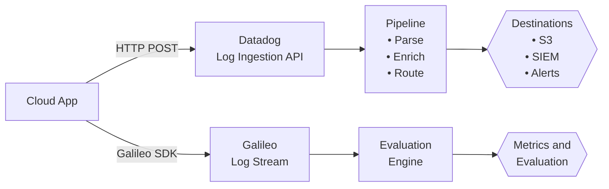

import Tabs from '@theme/Tabs';
import TabItem from '@theme/TabItem';

This page covers the prerequisites, tools, and conceptual model you'll need before working through the pipeline and observability documentation. Whether you're setting up log ingestion in Datadog, tracing large language model (LLM) calls in Galileo, or both, start here.

## What this section covers

This documentation covers two complementary observability workflows:

1. **Operational log ingestion and routing with Datadog**

   - Ingest JSON logs from cloud apps via the Datadog Log Ingestion application programming interface (API), apply pipeline processors, and route data to downstream destinations.

2. **LLM tracing and evaluation with Galileo**

   - Instrument AI-powered services with the Galileo software development kit (SDK) to capture traces, spans, and evaluation metrics for every LLM call.

Follow the docs in the recommended order:

1. **[Event streams and observability pipelines](./event-streams.md)**—Explore conceptual architecture and how Datadog and Galileo work together.
2. **[Ingest events using the Datadog Log Ingestion API](./api-ingest-stream.md)**—Learn endpoint parameters, authentication, and payload schemas.
3. **[Route cloud app logs into a pipeline](./sop-route-cloud-apps.md)**—Follow a hands-on guide to send and verify sample app logs.

## Tools you'll need

### For Datadog log ingestion
- **cURL or [Postman](https://www.postman.com/)**—Use these tools for sending API requests to the Datadog Log Ingestion API.
- **A terminal or shell**—macOS, Linux, or Windows PowerShell all work.
- **`jq`** (optional but recommended)—Use this tool for validating JSON payloads before sending them.

### For Galileo LLM tracing
- **Python 3.9+** or **Node.js 18+**—The Galileo SDK supports both environments.
- **`pip` or `npm`**—Use these tools to install the SDK.

<Tabs>
<TabItem value="python" label="Python" default>

```bash
pip install galileo
```

</TabItem>
<TabItem value="typescript" label="TypeScript">

```bash
npm install galileo
```

</TabItem>
</Tabs>


- **A code editor**, preferably [VS Code](https://code.visualstudio.com/download) ([Cursor](https://www.cursor.com/) and [Antigravity](https://antigravity.google/) are acceptable alternatives).

## Credentials you'll need

### Datadog
| Credential | Where to find it |
|---|---|
| **API key** | Datadog → **Organization Settings** → **API Keys** |
| **Datadog site address** | Depends on your region, for example, `datadoghq.com` (US) or `datadoghq.eu` (EU). See [Datadog sites](https://docs.datadoghq.com/getting_started/site/). |

### Galileo
| Credential | Where to find it |
|---|---|
| **API key** | [app.galileo.ai](https://app.galileo.ai) → **Settings** → **API Keys** |
| **Project name** | Set when you create a new project in Galileo. |
| **Log stream name** | Define this per environment, such as `dev`, `staging`, or `production`. |

:::note
For more information, visit [Where do I find my project keys?](https://v2docs.galileo.ai/references/faqs/find-keys) in the Galileo docs.
:::

## Who this documentation is for

| Persona | Primary use |
|---|---|
| **Platform engineers** | Build and maintain scalable Datadog log pipelines |
| **Site reliability engineers (SREs) and DevOps** | Normalize logs, reduce noise, and set up routing and alerting |
| **AI and machine learning (ML) engineers** | Instrument LLM services and score model quality with Galileo |
| **Security engineers** | Route audit and authentication logs to security information and event management (SIEM) destinations |
| **Developers** | Send app logs and trace LLM calls without deep infrastructure knowledge |

## What you should already know

These docs assume:

- Basic familiarity with JSON
- Comfort running command-line commands
- A general understanding of logs, events, or metrics
- Awareness of cloud or microservice environments

If you haven't sent a POST request before, the hands-on guide walks through the process step by step.

## Conceptual model

All workflows follow a two-track observability model:

<Tabs>
<TabItem value="image" label="Mermaid (image)" default>


</TabItem>
<TabItem value="diagram" label="Mermaid (code)">



</TabItem>
<TabItem value="ascii" label="ASCII">

```text title="ASCII diagram"
       [Cloud App]
      /           \
|HTTP POST|   |Galileo SDK|
     v               v
 [Datadog]       [Galileo]
 [Ingest API]    [Log Stream]
     |               |
     v               v
 [Pipeline]     [Evaluation]
 (Parse, Enrich,  [Engine]
     Route)          |
     |               v
     v          [Metrics and]
[Destinations]  [Evaluation]
  (S3, SIEM,
    Alerts)
```

</TabItem>
</Tabs>

**Datadog** handles your **operational telemetry**, including infrastructure logs, error rates, routing rules, and alerting. 

**Galileo** handles your **AI telemetry**, including LLM inputs and outputs, latency per span, and evaluation scores. 

Together they provide full-stack visibility across both layers of a modern cloud app.
