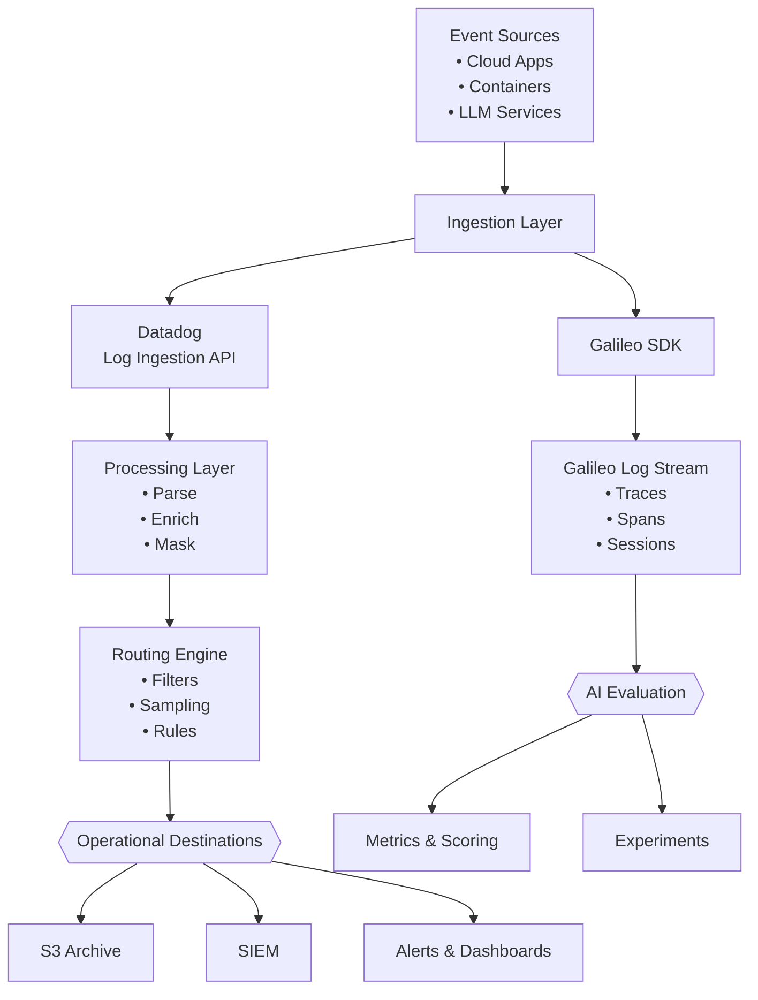

import Tabs from '@theme/Tabs'
import TabItem from '@theme/TabItem'

Modern systems emit massive amounts of telemetry: logs, metrics, traces, security events, and large language model (LLM) interactions. This document explains how **observability pipelines** help teams collect, shape, route, and evaluate telemetry data in real time. It also highlights where **Datadog** and **Galileo** fit into that architecture.

## Why observability pipelines matter

Raw telemetry is expensive, noisy, and inconsistently structured. Observability pipelines sit between your apps and your monitoring tools to address these challenges:

- **Reducing cost** by filtering or sampling high-volume logs before they reach expensive storage or security information and event management (SIEM) tools.
- **Improving data quality** with parsing, normalization, and metadata enrichment.
- **Protecting privacy** by masking or removing personally identifiable information (PII) early in the pipeline.
- **Surfacing quality signals** by capturing and evaluating LLM interactions alongside operational telemetry.

Every engineering, site reliability engineering (SRE), and AI team benefits from faster, cleaner, and more actionable data.

## Two layers of modern observability

In a stack that includes both traditional cloud services and LLM-powered features, you deal with two distinct telemetry layers—each requiring different tooling.

### Operational telemetry with Datadog

**Datadog** handles the infrastructure and app layer: log ingestion, metric collection, alerting, and pipeline routing. For example, you can send a `payment-gateway` error log and apply a Grok Parser to extract `transaction_id`. From there, you can route `status:error` events to a Slack alert or S3 archive.

Datadog provides **Log Management** for ingestion and pipeline processing alongside **Observability Pipelines** for routing telemetry at scale. It also includes **Log Explorer** for real-time search and Live Tail.

### Model telemetry with Galileo

**Galileo** handles the LLM layer: tracing individual model calls, capturing inputs and outputs, measuring latency per span, and scoring responses with evaluation metrics. Here, you can understand if your `payment-query` LLM function is returning accurate, grounded, and appropriately concise answers—and if that changes across deployments.

Galileo is an evaluation and observability platform purpose-built for AI applications. It supports Python and TypeScript SDKs while integrating with major LLM providers.

These two layers complement each other. Datadog identifies *that* an issue occurred, while Galileo reveals *why* model response quality degraded.

## High-level pipeline architecture

<Tabs>
<TabItem value="image" label="Mermaid (image)" default>


</TabItem>
<TabItem value="diagram" label="Mermaid (code)">



</TabItem>
<TabItem value="ascii" label="ASCII">

```text title="ASCII diagram"
       [Event Sources]
      (Apps, Containers, LLM)
             |
             v
      [Ingestion Layer]
      /               \
     v                 v
[Datadog API]    [Galileo SDK]
     |                 |
     v                 v
[Processing]     [Log Stream]
(Parse, Enrich,  (Traces, Spans,
     Mask)          Sessions)
     |                 |
     v                 v
[Routing Engine] [AI Evaluation]
(Filters, Rules) (Luna-2 Models)
     |                 |
     v                 v
[Operational]    [Experiments]
(S3, SIEM, Alerts)(Metrics, Runs)
```

</TabItem>
</Tabs>

## Event stream concepts

An **event stream** is a continuous, time-ordered flow of telemetry data. In a modern
app stack, event streams come from multiple sources simultaneously:

- App logs (for example, `payment-gateway` error events)
- Infrastructure metrics (CPU, memory, latency)
- Distributed tracing spans from app performance monitoring (APM) tools
- Security audit and authentication logs
- LLM call records: prompts, completions, latency, and token counts
- Container and Kubernetes events
- IoT device telemetry

The **LLM call record** is the newest addition to this list. As more apps incorporate AI features, capturing and evaluating these interactions has become as important as capturing traditional app logs.

## Core pipeline components

### 1. Ingestion layer

The ingestion layer is where raw telemetry first enters the system. 

For operational data, this means sending JSON payloads to the **Datadog Log Ingestion API** at `https://http-intake.logs.datadoghq.com/api/v2/logs`, authenticated with a `DD-API-KEY` header. 

For LLM data, this means instrumenting your app code with the **Galileo SDK**, which captures traces automatically when you wrap functions with the `@log` decorator or `GalileoLogger`.

Both paths handle authentication, validation, and buffering through different mechanisms suited to their data types.

### 2. Processing layer

Once data enters Datadog's pipeline, processors transform it before routing:

- **Sensitive Data Scanner**: detects and obfuscates PII like email addresses, credit card numbers, or customer IDs before data reaches downstream tools.
- **Grok Parser**: extracts structured fields from raw log strings.
- **Remapper**: remaps nested attributes (for example, `meta.customer_id`) to
  top-level attributes for easier filtering and faceting.
- **Lookup Processor**: enriches logs with external reference data, such as
  mapping `service` names to `team_owner` tags.

In Galileo, the equivalent layer uses **metric configuration** at the log stream level. Luna-2 evaluators automatically score LLM responses for correctness, groundedness, and tone as you log them.

### 3. Routing layer

The routing layer determines where processed events go based on content, business rules, or compliance requirements. In Datadog, you configure routing through **Log Pipelines** and **Indexes**:

- Route `status:error` logs to an on-call alert and an S3 archive simultaneously.
- Apply a sampling rule to reduce the volume of `status:info` logs hitting your index.
- Forward security-relevant events to a SIEM integration.
- Use the **Log Forwarding** feature to send specific log subsets to external
  HTTP endpoints.

In Galileo, you route telemetry by structuring records into distinct projects and log streams. This approach lets you evaluate and compare `dev`, `staging`, and `production` traces.

### 4. Destination layer

Observability pipelines deliver processed events to specialized downstream destinations:

| Destination type | Examples |
|---|---|
| Object storage | Amazon S3, Google Cloud Storage (GCS), Azure Blob Storage |
| SIEM | Splunk, Chronicle, QRadar |
| Search & analytics | Elastic, OpenSearch, Snowflake |
| Monitoring & alerting | Datadog Log Explorer, dashboards, monitors |
| AI evaluation | Galileo log streams, experiment results |

The cleaner and more targeted your routing is, the cheaper and faster your destinations run. Sending raw, unprocessed logs to a SIEM is one of the most common sources of unnecessary observability cost.

## Common use cases

### Operational telemetry with Datadog
- **Error alerting**: route `status:error` logs from `payment-gateway` to PagerDuty or Slack in real time.
- **Cost reduction**: apply a 10% sampling rule to `status:info` logs before indexing.
- **Security analytics**: forward authentication failures and audit logs to a SIEM.
- **Data normalization**: use a Grok Parser to standardize log formats across services written in different languages.

### Quality signals with Galileo
- **LLM tracing**: capture every prompt and completion from your AI features, organized by session and trace.
- **Response evaluation**: apply Luna-2 metrics to automatically score model outputs for quality, correctness, and groundedness.
- **Prompt experimentation**: run A/B tests on prompt changes in Galileo Experiments before deploying to your `production` log stream.
- **Cross-environment comparison**: compare model behavior in `staging` vs `production` using the same evaluation criteria.

## Key takeaways

- Modern apps produce two distinct telemetry streams: operational logs and LLM interaction records.
- Datadog handles operational ingestion, processing, and routing with a
  pipeline-based model built for high-throughput infrastructure data.
- Galileo handles AI telemetry through SDK-instrumented tracing and metric-based evaluation for LLM-powered features.
- Processing cleans and enriches data, routing directs it precisely, and destinations consume it efficiently.
- A well-designed pipeline reduces cost, improves reliability, and surfaces both infrastructure and AI quality signals in one observability strategy.

## Next steps

- [Log Ingestion API](./api-ingest-stream.md)
- [Route cloud app logs](./sop-route-cloud-apps.md)
- [Galileo Logging Basics](https://v2docs.galileo.ai/sdk-api/logging/logging-basics)
- [Datadog Log Management](https://docs.datadoghq.com/logs/)
