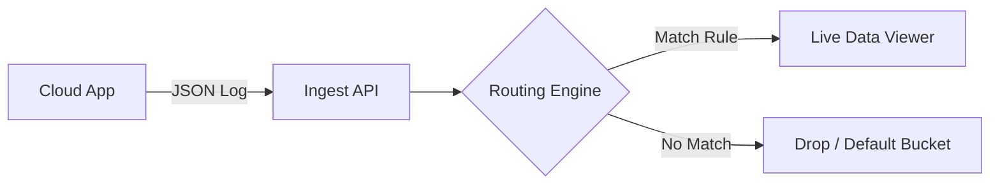

import Tabs from '@theme/Tabs';
import TabItem from '@theme/TabItem';

This guide walks you through the "Hello World" of observability pipelines: sending a single JSON log event from a cloud app (simulated via API) and verifying it in the platform.

**Goal:** Ingest a mock app log, verify it reached the pipeline, and prepare it for routing to a destination (like Splunk, Elastic, or S3).

---

## Why this matters

Before you build complex parsing rules or route data to expensive SIEMs, you need to trust your ingestion path.  
This workflow confirms:
1. Your API token works.
2. The pipeline accepts your JSON structure.
3. You can see the data in real time.

---

## Before you start

Ensure you have:
- **An API Token** (with `ingest` permissions).
- **Your unique Stream ID** (from the platform UI).
- **Terminal access** (to run `curl`) or **Postman**.

---

## Pipeline overview
<Tabs>
<tabitem value="diagram" label="Mermaid (code)" default>

</tabitem>

<tabitem value="image" label="Mermaid (image)" default>


</tabitem>

<tabitem value="ascii diagram" label="ASCII">
```pgsql
   [Your App]
       |
       |
       |
       (POST /v1/streams/ingest)
       v
+-----------------------+
|    Ingestion Node     |
+-----------------------+
       |
       v
+-----------------------+
|   Live Data Viewer    |  <-- We are verifying here
+-----------------------+
```
</tabitem>

</Tabs>
---

## 1. Create or select a stream

In your observability platform:
1. Go to **Streams** > **Management**.
2. Click **New Stream** (or select `default-logs`).
3. Copy the **Stream ID** (e.g., `st_12345`).
4. (Optional) Set a retention policy (default is usually 7 days).

---

## 2. Create a sample log event

We will simulate a cloud app log. Save this as `app-log.json`.

```json
{
  "timestamp": "2025-11-15T08:30:00Z",
  "service": "payment-gateway",
  "level": "ERROR",
  "message": "Transaction failed: Gateway timeout",
  "transaction_id": "txn_998877",
  "meta": {
    "region": "us-east-1",
    "customer_id": "cus_554433"
  }
}
```

> **Note:** Keep the `timestamp` in ISO 8601 format to ensure proper indexing.

---

## 3. Send the log event

Use `curl` to simulate the app sending the log.

```bash
export STREAM_ID="your_stream_id_here"
export API_TOKEN="your_api_token_here"

curl -X POST "https://api.observability-platform.com/v1/streams/ingest" \
     -H "Authorization: Bearer $API_TOKEN" \
     -H "Content-Type: application/json" \
     -H "X-Stream-Id: $STREAM_ID" \
     -d @app-log.json
```

### Expected response

```json
{
  "status": "accepted",
  "ingest_id": "evt_abc12345",
  "accepted_items": 1
}
```

If you see `status: accepted`, the pipeline received the data.

---

## 4. Verify your log in the live data viewer

1. Navigate to **Explore** or **Live Tail** in the platform UI.
2. Select your stream (`st_12345`).
3. Add a filter: `service == "payment-gateway"`.
4. You should see your event appear instantly:

```text
[ERROR] 2025-11-15T08:30:00Z service=payment-gateway msg="Transaction failed..."
```

---

## 5. Route logs to a destination

Now that data is flowing, create a routing rule:

1. Go to **Pipelines** > **Routing Rules**.
2. Click **New Rule**.
3. **Filter:** `level == "ERROR"`
4. **Action:** Route to `S3-Archive` AND `Slack-Alerts`.
5. **Save & Deploy**.

Send the `curl` request again.  
- Check your S3 bucket.
- Check your Slack channel.

---

## 6. Optimize the pipeline

Now that you have a working flow, consider adding:
- **Parsing:** Extract `customer_id` into a top-level field.
- **Enrichment:** Add a `team_owner` tag based on the `service` name.
- **Masking:** Obfuscate `customer_id` if it is PII.

---

## Troubleshooting

- **401 Unauthorized:** Check your API Token permissions.
- **400 Bad Request:** Validate your JSON syntax.
- **404 Not Found:** Verify the `X-Stream-Id` is correct.
- **Timestamp issues:** Ensure you are using UTC ISO 8601 format.
- **Data not showing:** Check if you have a filter active that excludes your new log.

---

## Next steps

- [Ingest API Reference](./api-ingest-stream.md)
- [Observability Concepts](./concept-observability-pipelines)
- Try sending different log types (VM logs, container logs, API events).