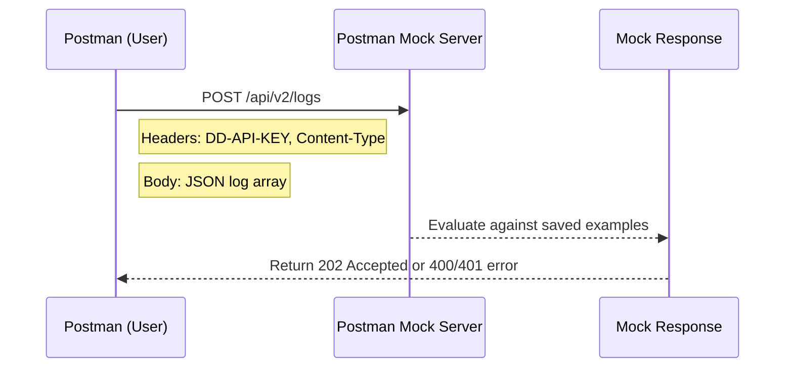

import Tabs from '@theme/Tabs';
import TabItem from '@theme/TabItem';

This guide explains how to use the provided Postman sample files to simulate the Datadog Log Ingestion application programming interface (API) locally. You can verify request formats, test error responses, and follow the hands-on guide examples without sending data to a live Datadog account.

## Prerequisites

- **[Postman](https://www.postman.com/downloads/)** (desktop or web version).
- Three JSON files included with this project:

  | File | Purpose |
  |---|---|
  | `DataPipeline-Environment.json` | Defines reusable variables: `dd_site`, `mock_base_url`, and `dd_api_key`. |
  | `DataPipeline-postman-collection.json` | Sends real requests to the Datadog Log Ingestion API (`/api/v2/logs`). |
  | `DataPipeline-MockServer-Collection.json` | Configures mock responses for the same endpoints using a Postman mock server. |

Download all three files:
[Download Postman files](https://github.com/pvega62/software/tree/3f2954fd16d57d7dd06b0e27c57daf3522e48c8a/downloads/mock-postman-json).

## 1. Import the files into Postman

1. Open Postman and click **Import**.
2. Select all three downloaded JSON files at once.
3. From the upper-right environment menu, select **Data Pipeline Environment**.

After you import the files, the following items appear:

- **Data Pipeline Documentation Project** (real API collection).
- **Data Pipeline — Mock Server Collection**.
- **Data Pipeline Environment**.

## 2. Create the mock server

1. In Postman, go to **Mock Servers** in the left sidebar.
2. Click **Create Mock Server**.
3. Select **Data Pipeline—Mock Server Collection**.
4. Keep the default settings and click **Create Mock Server**.

Postman generates a unique mock server address, for example:
`https://a12b34cd-1234-5678.mock.pstmn.io`

## 3. Update the environment variable

1. Go to **Environments** > **Data Pipeline Environment**.
2. Find the `mock_base_url` variable.
3. Replace the placeholder with your generated mock server address:

```text
# Before
https://mock-server-url-from-postman.io

# After
https://a12b34cd-1234-5678.mock.pstmn.io
```

4. Save the environment.

## 4. Send your first mock request

1. Open **POST /api/v2/logs** inside the **Mock Server Collection**.
2. Confirm the **Data Pipeline Environment** is active in the top-right menu.
3. Click **Send**.

The mock server returns a simulated `202 Accepted` response, mirroring the real
Datadog response:
`HTTP/1.1 202 Accepted`

> **Note:** The real Datadog Log Ingestion API returns a `202 Accepted` with no
> response body. The mock collection returns a minimal JSON object for readability
> during testing:

```json
{
  "status": "accepted",
  "message": "Log event received by mock server."
}
```

## 5. Test an error response

To test a `400 bad request` response, remove the `message` field from the request
body. This field is required in the Datadog Log Ingestion API.

The mock server returns the following JSON:

```json
{
  "errors": ["Invalid JSON"]
}
```

You can also test a `401 unauthorized` response by removing the `DD-API-KEY` header
from the request.

## 6. Switch between live and mock testing

Both collections use the same environment file. To switch between real and mock
testing, change which collection you use:

| Goal | Collection | Base address variable |
|---|---|---|
| Test with real Datadog | `DataPipeline-postman-collection.json` | `{{dd_site}}` → `datadoghq.com` |
| Test locally or offline | `DataPipeline-MockServer-Collection.json` | `{{mock_base_url}}` → your mock address |

This approach lets you verify request and response formats before sending live data to your
Datadog account.

## Visualizing the request flow

<Tabs>
<TabItem value="image" label="Mermaid (image)" default>


</TabItem>
<TabItem value="diagram" label="Mermaid (code)">



</TabItem>
<TabItem value="ascii" label="ASCII">

```text
+-----------------------+                       +-----------------------+
|        Postman        |   POST /api/v2/logs   |      Mock Server      |
|       (Client)        | --------------------> |                       |
|                       |                       |  Evaluate request     |
|   - DD-API-KEY header |                       |  against examples      |
|   - JSON log body     | <-------------------- |                       |
|                       |   202 / 400 / 401     |                       |
+-----------------------+                       +-----------------------+
```

</TabItem>
</Tabs>

## Why this matters

This mock server setup demonstrates the same verification pattern you use when
developing or documenting a real API integration:

- **Verify request structure** and required headers (`DD-API-KEY`, `Content-Type`) before sending live traffic.
- **Confirm JSON payloads** match the expected schema—an array of log objects, each with a `message` field.
- **Test error handling** (`400`, `401`, `429`) without consuming API quota or polluting a production log index.
- **Develop and verify documentation** examples against a stable, reproducible endpoint.

The same pattern applies when documenting the **Galileo software development kit (SDK)**. You test instrumented
functions in a `dev` log stream before promoting them to `production`, ensuring that you configure evaluation
metrics correctly before real user traffic flows through.
