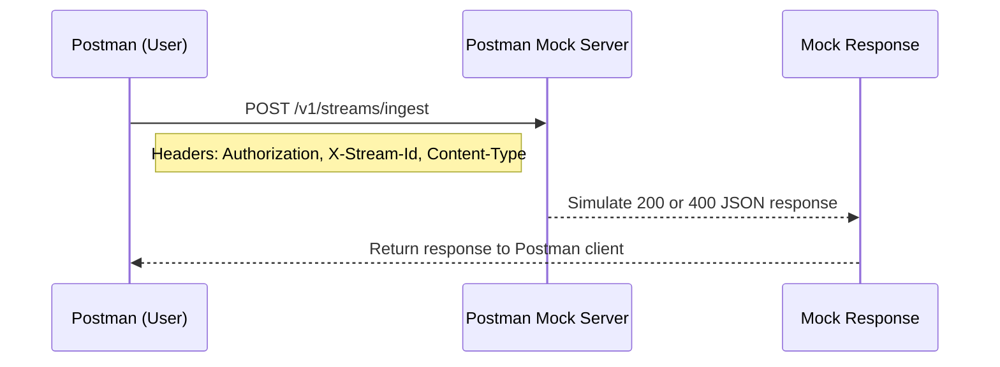
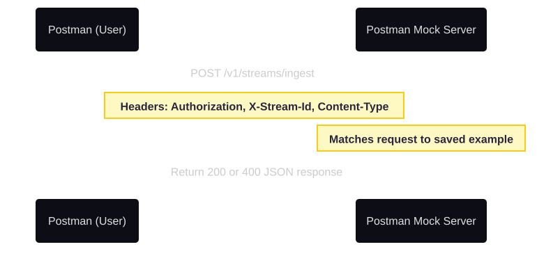

import Tabs from '@theme/Tabs';
import TabItem from '@theme/TabItem';

This guide explains how to use the provided Postman sample files to create a mock API environment. You’ll simulate the same endpoints shown throughout the documentation—no live back-end required.

---

## Prerequisites

* [Postman](https://www.postman.com/downloads/) (desktop or web version)
* Three JSON files included with this project:

  * `DataPipeline-Environment.json` - defines reusable variables such as `base_url`, `mock_base_url`, `api_token`, and `stream_id`.
  * `DataPipeline-postman-collection.json` - simulates the documentation’s Streaming Ingest API for real or staged testing.
  * `DataPipeline-MockServer-Collection.json` - configures mock responses for the same endpoints using a Postman Mock Server.

Download all three here:
[Download Postman Files](https://github.com/pvega62/software/tree/3f2954fd16d57d7dd06b0e27c57daf3522e48c8a/downloads/mock-postman-json)

---

## Step 1. Import the files into Postman

1. Open Postman and click **Import**.
2. Upload:

   * The two collections (`DataPipeline-postman-collection.json` and `DataPipeline-MockServer-Collection.json`).
   * The environment (`DataPipeline-Environment.json`).
3. From the upper-right environment menu, select **Data Pipeline Environment**.

You should now see:

* **Data Pipeline Documentation Project**
* **Data Pipeline - Mock Server Collection**
* **Data Pipeline Environment**

---

## Step 2. Create the mock server

1. Go to **Mock Servers** in Postman.
2. Click **Create Mock Server**.
3. Choose **Data Pipeline—Mock Server Collection**.
4. Keep default settings and click **Create Mock Server**.

Postman will generate a unique mock-server address, for example:

```
https://a12b34cd-1234-5678.mock.pstmn.io
```

---

## Step 3. Update the environment variable

1. Go to **Environments → Data Pipeline Environment**.
2. Find the variable `mock_base_url`.
3. Replace the placeholder value:

```
# old
https://mock-server-url-from-postman.io

# new
https://a12b34cd-1234-5678.mock.pstmn.io
```

4. Save the environment.

---

## Step 4. Send your first mock request

1. Open **POST /v1/streams/ingest** inside the **Mock Server Collection**.
2. Confirm the environment is active.
3. Click **Send**.

You should see a `200 OK` mock response:

```json
{
  "status": "accepted",
  "ingested_bytes": 204,
  "stream_id": "demo-stream-001",
  "message": "Event successfully received by mock server."
}
```

---

## Step 5. Test an error response

Remove a required header or edit the JSON body to trigger a `400 Bad Request` response.

```json
{
  "error": "invalid_format",
  "detail": "Missing or invalid 'timestamp' field. Expected ISO 8601 format."
}
```

---

## Step 6. Visualizing the request flow

<Tabs>
<tabitem value="diagram" label="Mermaid (code)" default>


</tabitem>

<tabitem value="image" label="Mermaid (image)" default>


</tabitem>

<tabitem value="ascii diagram" label= "ASCII" default>

```
+------------+          +--------------------+          +------------------------+
|  Postman   |  ----->  |  Mock Server (API) |  ----->  |  Mock Response (JSON)  |
+------------+          +--------------------+          +------------------------+
      |                          |                               |
      |  POST /v1/streams/ingest |                               |
      |  Headers + JSON Body     |                               |
      +----------------------------------------------------------+
```
</tabitem>
</Tabs>
---

## Step 7. Switch between live and mock testing

* To test “live” examples, use **DataPipeline-postman-collection.json** with `{{base_url}}`.
* To test locally or offline, use **DataPipeline-MockServer-Collection.json** with `{{mock_base_url}}`.
* Both rely on the same `DataPipeline-Environment.json` for variable management.

This lets you test both your documentation examples and mock API without changing URLs manually.

---

## Why this matters

Using Postman Mock Servers and collections enables you to:

* Follow tutorials and API examples exactly as written.
* Validate request and response formats before deployment.
* Test both real and simulated environments with a single configuration.
* Develop and verify documentation alongside API design.


---

## Next steps

* Review the [Ingest API Reference](/docs/data-pipelines/api-ingest-stream)
* Try the [Routing Cloud Application Logs Guide](/docs/data-pipelines/route-cloud-app-logs-guide)
* Complete the [Before You Start](/docs/data-pipelines/before-you-start) checklist
