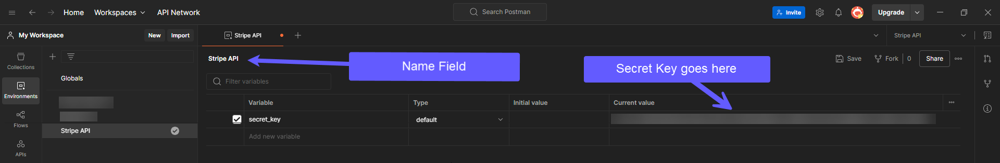

## What's Postman?
Postman is a collaborative platform for API development. Developers can use Postman to develop, manage, test, and document APIs. Its user-friendly interface makes it simple to collaborate on APIs, making it an ideal platform for cross-functional teams.

## Setting up Postman

1.  Download and install the [Postman app](https://www.postman.com/).
2.  Open the Postman application and complete the setup process.

3.  Enter “Stripe” in the search bar at the top of the page and select **Stripe Developers APIs**.

4.  In the Collection tab, find the most recent collection and click the **Fork** button to add it to your collection.

## Generating your secret keys

Stripe servers authenticate and authorize API requests using bearer token authorization. To set this up, you will need to create a Stripe account.

1.  Go to https://dashboard.stripe.com/ and follow the instructions there to create your account.
2.  The secret key is on the homepage of the dashboard. Click it to copy it to your clipboard.  
    :::note
    Don't share your secret key with other users for security purposes.
    :::
3.  Return to the Postman app.
4.  Click **Environments > Add (+)**.
5.  Enter a name for the environment in the Name field (e.g., **Stripe API**).

6.  In the **Variable** cell, enter `secret_key`.
7.  In the **Current Value** cell, paste the secret key copied from the Stripe Dashboard.
8.  Click on **Save**.

9.  To set the environment to the **Stripe API** environment, click the **Environment** dropdown menu in the top right corner of the workspace.

Stripe servers will now authenticate and authorize your API requests.

## Connection prerequisites

To connect to the Stripe API, you need the base URL: `https://api.stripe.com`

