import Tabs from '@theme/Tabs'
import TabItem from '@theme/TabItem'

# API reference: `getOwnedObjects`

Retrieves a paginated list of on-chain objects owned by a specific 32-byte Sui wallet address.

Use this method to populate wallet dashboards, user inventory screens, and token balance lists. Because a single account can hold thousands of objects, the Sui JSON-RPC API returns owned objects in discrete pages using cursor-based pagination. Because `getOwnedObjects` is a read operation served directly from fullnode local state, it executes immediately without submitting a transaction or consuming gas.

- **Class:** `SuiClient`
- **Package:** `@mysten/sui/client`
- **Operation type:** read operation (no gas, no wallet signature)

---

## Overview

Calling `getOwnedObjects` queries the fullnode index for objects with ownership assigned to the target address (`AddressOwner`). To avoid high latency and network timeouts, fullnodes paginate results rather than returning an entire inventory in a single response.

### Visualizing the pagination loop
<Tabs>
  <TabItem value="image" label="Mermaid (image)" default>

  

  </TabItem>
  <TabItem value="code" label="Mermaid (code)">

  ```mermaid
  flowchart TD
      Start([Start Pagination]) --> Init["Initialize cursor = null<br/>allObjects = []"]
      Init --> Query["Call getOwnedObjects<br/>(cursor, limit: 50)"]
      Query --> Resp["Receive response:<br/>data[], hasNextPage, nextCursor"]
      Resp --> Append["Append items to<br/>allObjects array"]
      Append --> Check{"hasNextPage == true?"}
      Check -->|Yes| Update["Update cursor = nextCursor"]
      Check -->|No| Done([Return all accumulated objects])
      Update -.->|Next page| Query
  ```

  </TabItem>
  <TabItem value="ascii" label="ASCII">

  ```text
  Pagination Flow (Cursor Loop):

  Client                                   Fullnode
    │                                         │
    │── getOwnedObjects(cursor: null) ───────►│ (Page 1: limit 50)
    │◄── { data: [50 items], nextCursor } ────│
    │                                         │
    │── getOwnedObjects(cursor: nextCursor) ─►│ (Page 2: limit 50)
    │◄── { data: [12 items], hasNextPage: false }
  ```

  </TabItem>
</Tabs>


## Signature

```typescript title="Signature"
client.getOwnedObjects(input: GetOwnedObjectsParams): Promise<PaginatedObjectsResponse>
```

## Parameters

The method accepts a configuration object with the following properties:

| Parameter | Type | Required | Description |
| :--- | :--- | :--- | :--- |
| `owner` | `string` | **Yes** | The 32-byte hexadecimal address of the target wallet. |
| `filter` | `SuiObjectDataFilter` | No | Criteria to filter results by type, package, or module. |
| `options` | `SuiObjectDataOptions` | No | Flags to include additional details (for example, `showType`, `showContent`, `showDisplay`). |
| `cursor` | `string \| null` | No | The `nextCursor` token from a previous response to fetch the subsequent page. |
| `limit` | `number` | No | Maximum items to return per page (default and maximum is typically 50 on public RPC nodes). |

### `SuiObjectDataFilter`

The `filter` parameter narrows queries on the fullnode, saving bandwidth and client-side processing:

| Filter Key | Value Type | Description |
| :--- | :--- | :--- |
| `MatchAll` | `SuiObjectDataFilter[]` | Logical AND. An object must satisfy all provided filter criteria. |
| `MatchAny` | `SuiObjectDataFilter[]` | Logical OR. An object can satisfy any of the provided filter criteria. |
| `StructType` | `string` | Exact match for a fully qualified Move Struct type (for example, `0x2::coin::Coin<0x2::sui::SUI>`). |
| `Package` | `string` | Matches any object instantiated from modules within the specified package ID. |
| `MoveModule` | `{ package: string, module: string }` | Matches any object defined within a specific module of a package. |

---

## Return value

Returns a `Promise` that resolves to a `PaginatedObjectsResponse` object:

```json title="Response"
{
  "data": [
    { "data": { "objectId": "0xA...", "version": "1", "type": "0x2::coin::Coin<0x2::sui::SUI>" } },
    { "data": { "objectId": "0xB...", "version": "4", "type": "0x2::coin::Coin<0x2::sui::SUI>" } }
  ],
  "hasNextPage": true,
  "nextCursor": "0x12345...ResultCursor"
}
```

The response envelope contains the following fields:

| Field | Type | Description |
| :--- | :--- | :--- |
| `data` | `SuiObjectResponse[]` | Array of object response envelopes for the current page. |
| `hasNextPage` | `boolean` | Indicates whether additional pages of objects exist. |
| `nextCursor` | `string \| null` | Opaque pagination token to pass as `cursor` in the next call. When `hasNextPage` is `false`, this value is `null`. |

---

## Usage examples

### Fetch the first page of an inventory
Retrieve the first 5 objects owned by an address:

```javascript title="basicInventory.js"
const response = await client.getOwnedObjects({
    owner: '0x0123456789abcdef0123456789abcdef0123456789abcdef0123456789abcdef',
    limit: 5,
    options: { showType: true }
});

response.data.forEach((item) => {
    if (item.data) {
        console.log(`ID: ${item.data.objectId}, Type: ${item.data.type}`);
    }
});
```

### Filter assets by Move struct type
Query only SUI coin objects owned by a user, excluding other tokens and NFTs:

```javascript title="filterCoins.js"
const response = await client.getOwnedObjects({
    owner: '0x0123456789abcdef0123456789abcdef0123456789abcdef0123456789abcdef',
    filter: {
        StructType: '0x2::coin::Coin<0x2::sui::SUI>'
    },
    options: { showContent: true }
});

console.log(`Found ${response.data.length} SUI coin objects`);
```

### Paginate through all owned objects
Use a `while` loop to traverse through every object an address owns:

```javascript title="pagination.js"
let hasNextPage = true;
let nextCursor = null;
const allObjects = [];

while (hasNextPage) {
    const response = await client.getOwnedObjects({
        owner: '0x0123456789abcdef0123456789abcdef0123456789abcdef0123456789abcdef',
        cursor: nextCursor,
        limit: 50
    });

    allObjects.push(...response.data);
    
    hasNextPage = response.hasNextPage;
    nextCursor = response.nextCursor;
}

console.log(`Total objects fetched: ${allObjects.length}`);
```

---

## Common errors

| Error code | Cause | Resolution |
| :--- | :--- | :--- |
| `cursor_invalid` | The string passed to `cursor` is expired, malformed, or originates from a different query. | Pass the exact string returned in `nextCursor` from the preceding query. |
| `limit_exceeded` | The requested `limit` exceeds the fullnode maximum allowed page size (typically 50). | Reduce the `limit` parameter to 50 or fewer items. |

---

## See also

- [`getObject`](./api-get-object.md) retrieves details for an individual on-chain object.
- [`multiGetObjects`](./api-get-multi-objects.md) fetches details for multiple specific objects in a single batch request.
- [How to fetch object data](./tutorial-fetch-data.md) provides a step-by-step tutorial for implementing read operations in Node.js.
- [The SuiClient architecture](./concept-suiguide.md) explains the conceptual design of `SuiClient` and read operations.